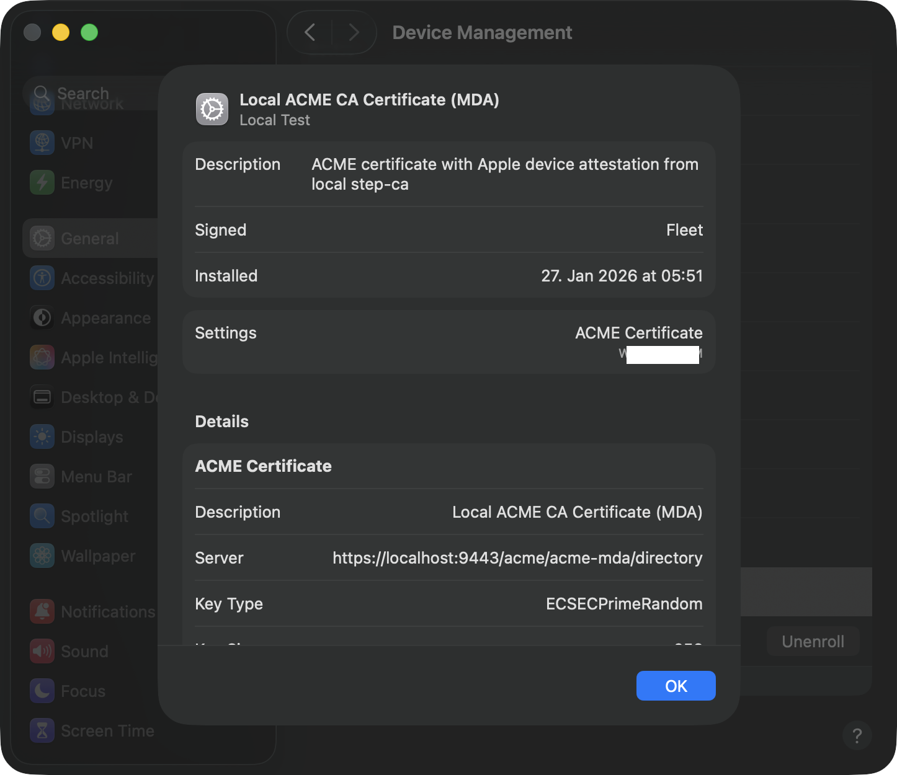
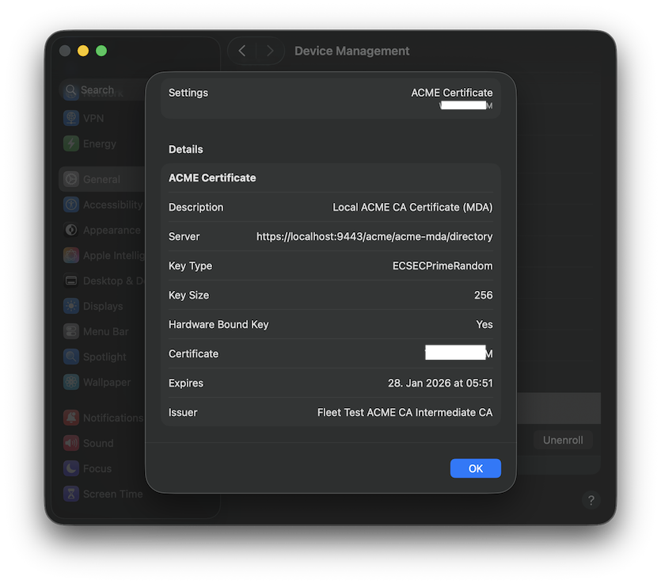
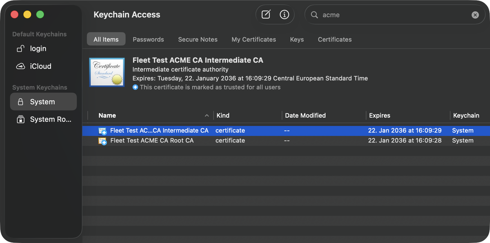
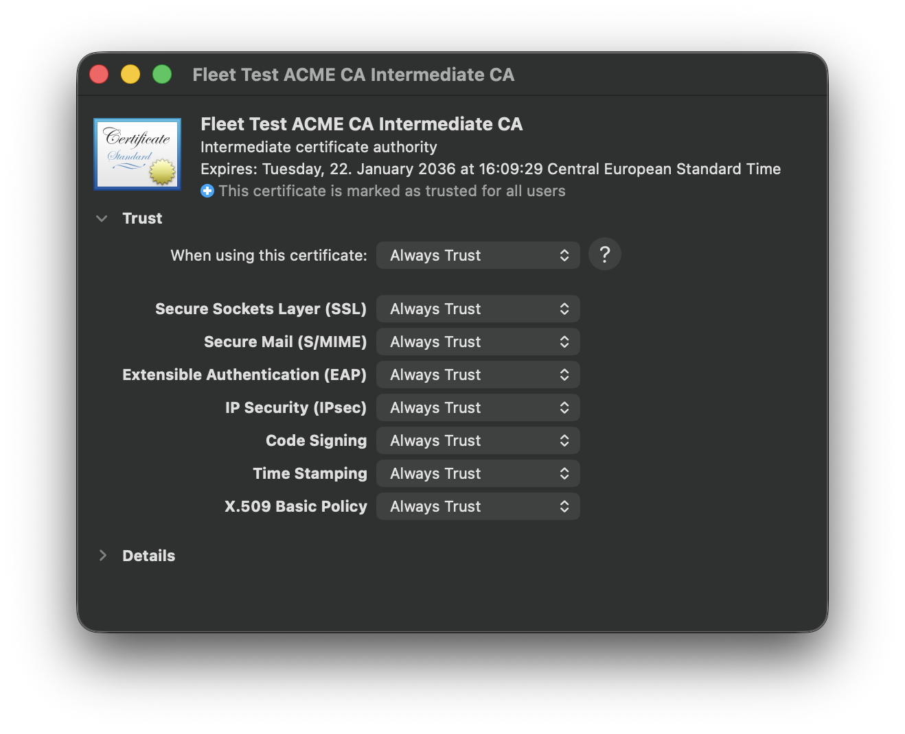
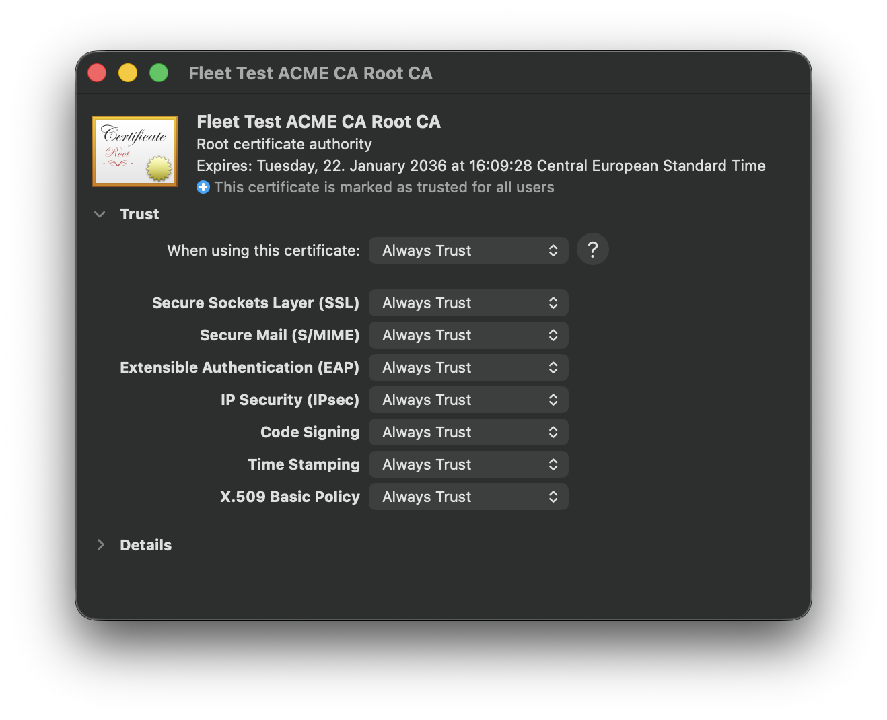

# Local ACME CA Container

A local step-ca instance configured for ACME using [smallstep/step-ca](https://github.com/smallstep/certificates) configured with Apple device attestation (MDA) support.

## Features

- Standard ACME provisioner (`acme`) - HTTP-01, DNS-01, TLS-ALPN-01 challenges
- Device Attestation provisioner (`acme-mda`) - device-attest-01 challenge for Apple devices
- Works with both Apple Container and Docker
- Pre-configured mobileconfig profiles for testing
- Runs local on Apple Container - https://github.com/apple/container

## Quick Start

### 0. Create Environment File

```bash
./scripts/create-env.sh
```

This creates `.env` with default configuration. Edit it to customize settings.

### 1. Start the CA

**Apple Container:**

Requirements:
- Apple Silicon M3/M4 or similar
- Apple Container - https://github.com/apple/container

```bash
./scripts/start-apple-container.sh
```

Terminal session example:
```
./scripts/start-apple-container.sh
=== Starting Local ACME CA (Apple Container) ===
Ensuring container system is running...
Starting container system service...
Verifying apiserver is running...
No default kernel configured.
Install the recommended default kernel from [https://github.com/kata-containers/kata-containers/releases/download/3.17.0/kata-static-3.17.0-arm64.tar.xz]? [Y/n]: y
Installing kernel...
Stopping existing container...
Pulling step-ca image...
Starting step-ca container...
local-acme-ca

Waiting for CA to start...
...
=== CA Started Successfully ===

Health:               https://localhost:9443/health
ACME Directory:       https://localhost:9443/acme/acme/directory
ACME MDA Directory:   https://localhost:9443/acme/acme-mda/directory
Root CA:              https://localhost:9443/roots.pem

Container: local-acme-ca

Commands:
  View logs:  container logs local-acme-ca
  Stop:       container kill local-acme-ca
  Remove:     container rm local-acme-ca
```
**Docker:**
```bash
./scripts/start-docker.sh
```

### 2. Generate Trust Profile

If this is a fresh CA instance (new certificates), regenerate the trust profile:

```bash
./scripts/generate-trust-profile.sh
```

This creates `profiles/local-ca-trust.mobileconfig` with the current CA certificates embedded.

### 3. Trust the Root CA

**Option A - Install trust mobileconfig (recommended for MDM testing):**

```bash
open profiles/local-ca-trust.mobileconfig
```

**Option B - Add to system keychain directly:**

```bash
./scripts/setup-trust.sh
```

Both options install the local CA's root certificate into your macOS trust store.

### 4. Install the local ACME MDA profile

To deploy via Fleet:

1. Go to **Controls > OS settings > Custom settings**
2. Click **Add profile** and upload `local-acme-mda-device.mobileconfig`
3. Optionally upload `local-acme-mda-user.mobileconfig` for user-scoped certificates
4. Scope the profiles to target hosts



Validate the profile is installed:

```
profiles -C -v 2>&1 | grep -B5 -A15 "com.local.acme-ca.mda"
_computerlevel[3]            payload[1] uuid			= D3ADB33F-D501-4768-9A31-1A18A4E1E807
_computerlevel[4] attribute: name: Local ACME CA Certificate (MDA)
_computerlevel[4] attribute: configurationDescription: ACME certificate with Apple device attestation from local step-ca
_computerlevel[4] attribute: installationDate: 2026-01-27 04:51:17 +0000
_computerlevel[4] attribute: organization: Local Test
_computerlevel[4] attribute: profileIdentifier: com.local.acme-ca.mda.profile
_computerlevel[4] attribute: profileUUID: LOCAL-ACME-CNFG-0001-000000000001
_computerlevel[4] attribute: profileType: Configuration
_computerlevel[4] attribute: removalDisallowed: FALSE
_computerlevel[4] attribute: version: 1
_computerlevel[4] attribute: containsComputerItems: TRUE
_computerlevel[4] attribute: installedByMDM: TRUE
_computerlevel[4] attribute: internaldata: TRUE
_computerlevel[4] payload count = 1
_computerlevel[4]            payload[1] name			= Local ACME CA Certificate (MDA)
_computerlevel[4]            payload[1] description		= ACME certificate with Apple device attestation from local CA
_computerlevel[4]            payload[1] type			= com.apple.security.acme
_computerlevel[4]            payload[1] organization		= (null)
_computerlevel[4]            payload[1] identifier		= com.local.acme-ca.mda
_computerlevel[4]            payload[1] uuid			= LOCAL-ACME-MDA-0001-000000000001
_computerlevel[5] attribute: name: macadmin.me enrollment
_computerlevel[5] attribute: configurationDescription: (null)
_computerlevel[5] attribute: installationDate: 2026-01-17 22:54:44 +0000
_computerlevel[5] attribute: organization: macadmin.me
_computerlevel[5] attribute: profileIdentifier: com.fleetdm.fleet.mdm.apple
_computerlevel[5] attribute: profileUUID: D3ADB33F-CE30-4C05-93E3-B235C152404E
_computerlevel[5] attribute: profileType: Configuration
_computerlevel[5] attribute: removalDisallowed: FALSE
_computerlevel[5] attribute: version: 1
_computerlevel[5] attribute: containsComputerItems: TRUE
_computerlevel[5] attribute: installedByMDM: FALSE
_computerlevel[5] attribute: internaldata: TRUE
_computerlevel[5] payload count = 2
_computerlevel[5]            payload[1] name			= (null)
```

### 5. Verify

Check Keychain Access for a certificate issued by "Fleet Test ACME CA Intermediate CA".

**Verify local ACME MDA profile is installed:**
```bash
profiles -C -v 2>&1 | grep -B5 -A15 "com.local.acme-ca.mda"
```

Expected output:
```
_computerlevel[X] attribute: name: Local ACME CA Certificate (MDA)
_computerlevel[X] attribute: configurationDescription: ACME certificate with Apple device attestation from local step-ca
_computerlevel[X] attribute: profileIdentifier: com.local.acme-ca.mda.profile
...
_computerlevel[X]            payload[1] type = com.apple.security.acme
_computerlevel[X]            payload[1] identifier = com.local.acme-ca.mda
```

**Verify device attestation (MDA) was used:**
```bash
container logs local-acme-ca 2>&1 | grep "device-attest-01" | grep "valid"
```

Expected output showing successful attestation:
```
response="{"type":"device-attest-01","status":"valid",...}"
```

If you see `"status":"valid"` for `device-attest-01`, the Apple device attestation was successfully verified.

**Verify certificate was issued:**
```bash
security find-certificate -a -c "Fleet Test ACME CA Intermediate" /Library/Keychains/System.keychain
```








## Endpoints

| Endpoint | URL |
|----------|-----|
| Health | https://localhost:9443/health |
| Root CA | https://localhost:9443/roots.pem |
| ACME Directory | https://localhost:9443/acme/acme/directory |
| ACME MDA Directory | https://localhost:9443/acme/acme-mda/directory |

## Device Attestation Flow

When you install the mobileconfig profile:

1. macOS contacts the ACME directory at `https://localhost:9443/acme/acme-mda/directory`
2. Creates an ACME account
3. Submits a certificate order with `device-attest-01` challenge
4. macOS generates device attestation using Secure Enclave
5. step-ca verifies the Apple attestation chain
6. Certificate is issued and stored in Keychain

## Profiles

| Profile | Description |
|---------|-------------|
| `local-acme-mda.mobileconfig` | Template with placeholder serial |
| `local-acme-mda-device.mobileconfig` | Device cert (System scope) |
| `local-acme-mda-user.mobileconfig` | User cert (User scope) |
| `local-ca-trust.mobileconfig` | CA trust profile (run generate-trust-profile.sh) |

### Profile Configuration

Key settings in the ACME payload:

```xml
<key>DirectoryURL</key>
<string>https://localhost:9443/acme/acme-mda/directory</string>

<key>Attest</key>
<true/>

<key>HardwareBound</key>
<true/>
```

- `DirectoryURL` - Points to local step-ca MDA provisioner
- `Attest` - Enables device-attest-01 challenge
- `HardwareBound` - Key stored in Secure Enclave

## Troubleshooting

### Container system not started (Apple Container)

If you see an error like:
```
Error: interrupted: "XPC connection error: Connection invalid"
Ensure container system service has been started with `container system start`.
```

Run manually:
```bash
container system start
```

The first time you run this, it will prompt to install a kernel. Accept the prompt to download and install the default kernel from the Kata Containers project.

### Certificate not trusted

Ensure root CA is installed:
```bash
security find-certificate -c "Fleet Test ACME CA Root CA" /Library/Keychains/System.keychain
```

If not found, run:
```bash
./scripts/setup-trust.sh
```

**Important:** If you manually installed the Trust certificates (not via MDM -> mobileconfig), you need to manually set trust in Keychain Access, also validate this when Trust certificates install via MDM:

1. Open **Keychain Access**
2. Find **"Fleet Test ACME CA Root CA"** in the System keychain
3. Double-click it, expand **Trust**, and set **"When using this certificate"** to **"Always Trust"**
4. Repeat for **"Fleet Test ACME CA Intermediate CA"**
5. Close the dialogs and enter your password when prompted

### Profile installation fails (NSURLErrorDomain -1004)

If you see:
```
NSURLErrorDomain (-1004): Could not connect to the server.
```

The CA container is not running. Check status and start it:

```bash
# Check if container is running
container list

# Start the CA
./scripts/start-apple-container.sh
```

Verify CA is accessible:
```bash
curl -sk https://localhost:9443/health
```

View CA logs:
```bash
container logs local-acme-ca
```

### Container already exists

If you see:
```
Error: exists: "container with id local-acme-ca already exists"
```

Remove the existing container manually:
```bash
container rm local-acme-ca
```

Then run the start script again.

### Attestation verification fails (NSOSStatusErrorDomain -67673)

If profile installation fails with:
```
NSOSStatusErrorDomain (-67673): failed to successfully respond to challenge
```

Check the CA logs for the specific error:
```bash
container logs local-acme-ca
```

**Common cause: ClientIdentifier mismatch**

If logs show:
```
challenge identifier "local-device-SERIAL" doesn't match any of the attested hardware identifiers ["UDID" "SERIAL"]
```

The `ClientIdentifier` in the mobileconfig must exactly match one of the device's attested hardware identifiers (either the serial number or UDID). Do not add prefixes like `local-device-`.

Correct:
```xml
<key>ClientIdentifier</key>
<string>$FLEET_VAR_HOST_HARDWARE_SERIAL</string>
```

Incorrect:
```xml
<key>ClientIdentifier</key>
<string>local-device-$FLEET_VAR_HOST_HARDWARE_SERIAL</string>
```

**Other causes:**

Step-ca's `attestationRoots` configuration expects inline certificate data, not file paths. The `acme-mda` provisioner is configured with `"attestationFormats": ["apple"]` and step-ca uses Apple's built-in attestation roots by default.

If you need to debug, check the provisioner config:
```bash
cat data/config/ca.json | jq '.authority.provisioners[] | select(.name=="acme-mda")'
```

### Container fails to start (attestationRoots parse error)

If container logs show:
```
error parsing /home/step/config/ca.json: error unmarshaling provisioner: json: cannot unmarshal string into Go struct field ACME.attestationRoots of type uint8
```

This means the `attestationRoots` format is incorrect. Step-ca expects raw certificate bytes, not PEM strings or file paths. Remove the `attestationRoots` field from `data/config/ca.json` and let step-ca use its built-in Apple attestation roots.

## Configuration

Edit `.env` to customize:

```bash
CA_NAME=local-acme-ca
ACME_PORT=9443
CONTAINER_NAME=local-acme-ca
```

## Provisioners

| Name | Type | Challenges |
|------|------|------------|
| admin | JWK | Token-based (for CLI) |
| acme | ACME | http-01, dns-01, tls-alpn-01 |
| acme-mda | ACME | device-attest-01 (Apple) |

## Files

```
acme-ca-local-container/
├── .env                        # Configuration (created by scripts/create-env.sh)
├── .gitignore                  # Git ignore file
├── docker-compose.yml          # Docker Compose config
├── README.md
├── data/
│   ├── config/
│   │   └── ca.json             # step-ca configuration
│   ├── certs/
│   │   ├── root_ca.crt         # Root CA certificate (install this)
│   │   ├── intermediate_ca.crt
│   │   └── apple/              # Apple attestation roots
│   ├── secrets/
│   │   ├── root_ca_key
│   │   ├── intermediate_ca_key
│   │   └── password
│   └── db/                     # Certificate database
├── profiles/
│   ├── local-acme-mda.mobileconfig        # Template
│   ├── local-acme-mda-device.mobileconfig # Device-specific
│   ├── local-acme-mda-user.mobileconfig   # User certificate
│   └── local-ca-trust.mobileconfig        # CA trust (generated)
├── screenshots/                # Documentation screenshots
└── scripts/
    ├── create-env.sh           # Create .env file (run first)
    ├── start-apple-container.sh
    ├── start-docker.sh
    ├── stop.sh
    ├── setup-trust.sh          # Install root CA trust
    └── generate-trust-profile.sh # Generate trust mobileconfig
```

## Manual Certificate Request (CLI)

Using step CLI:

```bash
# Bootstrap (one-time)
step ca bootstrap --ca-url https://localhost:9443 \
  --fingerprint $(openssl x509 -in data/certs/root_ca.crt -noout -fingerprint -sha256 | cut -d= -f2 | tr -d :)

# Get certificate via JWK provisioner
step ca certificate test.local test.crt test.key \
  --provisioner admin \
  --provisioner-password-file data/secrets/password
```

## References

- [Smallstep ACME Device Attestation](https://smallstep.com/docs/step-ca/provisioners/#acme)
- [Smallstep Private ACME Server](https://smallstep.com/blog/private-acme-server/)
- [Apple ACME Payload](https://github.com/apple/device-management/blob/release/mdm/profiles/com.apple.security.acme.yaml)
- [Apple Developer Documentation - ACME Certificate](https://developer.apple.com/documentation/devicemanagement/acmecertificate)
- [Apple Managed Device Attestation](https://support.apple.com/en-sg/guide/deployment/dep28afbde6a/web)
